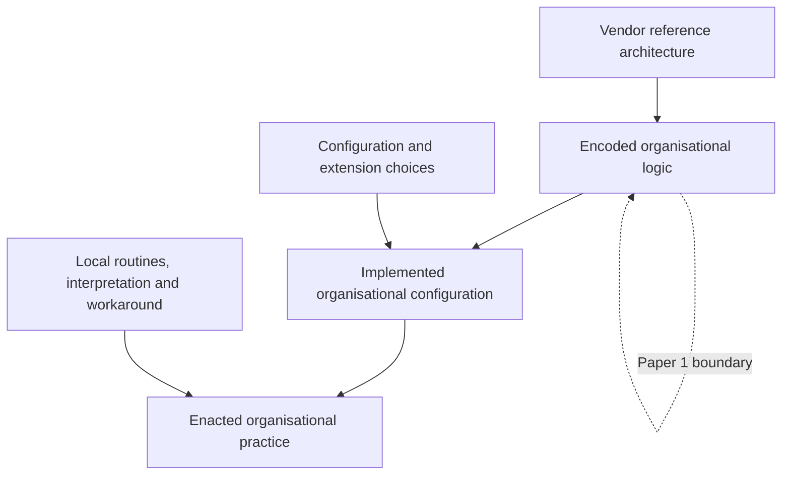
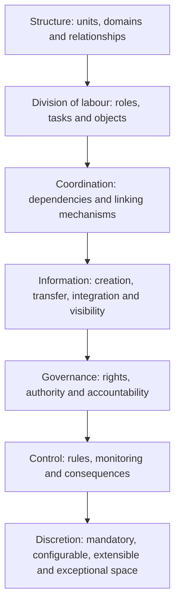

# Conceptual Framework

## Enterprise software as encoded organisation

Encoded organisational logic is the representation and operationalisation of assumptions about differentiated work, dependency, information, authority, control, and legitimate variation within a software reference architecture. “Encoded” includes executable rules and workflows as well as reference models, role templates, and structural definitions that prescribe or enable configuration. It does not imply that all documentation is executable or that use conforms to design.

The arrows represent translation, not deterministic causation. Implementation selects and changes reference elements; enactment may reproduce or depart from the configured arrangement. Documentary analysis is valid for B and provides propositions - not evidence - about C or D.

## Layered analytical model

The model is an analytical sequence rather than a universal causal hierarchy. **Structure** identifies recognised organisational territories such as company codes, plants, purchasing organisations, and sales organisations. These constructs establish scopes for action, data, and responsibility. **Division of labour** allocates activities to business roles, system actors, and organisational units. It makes differentiation observable.

**Coordination** addresses dependencies produced by differentiation. Sequential gating, common master data, workflow routing, and iterative exception resolution are candidate linking mechanisms. **Information** specifies what is made knowable: who creates a record, how it moves or is shared, how it is aggregated, and where visibility is restricted. It is separated from coordination because information availability is a capacity that may support several coordination forms.

**Governance** allocates legitimate action and decision. A role may receive an app yet be restricted to a plant; an approver may exercise authority only above a threshold. **Control** compares actions or states with formal premises and attaches consequences such as rejection, blocking, release, or escalation. Governance asks who may decide; control asks how conduct and outputs are constrained and observed. **Discretion** cuts across all layers but is placed last to force a relational question: after structures, work, information, authority, and controls are specified, which choices remain, for whom, and through which sanctioned mechanism?

## Primary theoretical lenses

Thompson predicts that different interdependencies create different coordination demands: pooled activities rely on common rules and resource allocation; sequential activities require planning and scheduling; reciprocal activities require richer adjustment. Mintzberg differentiates direct supervision, standardisation of work processes, outputs, and skills, and mutual adjustment. Galbraith treats design as matching information-processing capacity to uncertainty. These lenses are complementary but not collapsed. Interdependence describes a task relation, coordination describes a response, and information processing describes requirements and capacities. Governance adds rights and authority that the three lenses address unevenly.

## Software organisational primitive

A software organisational primitive is a recurring, bounded software construct through which an organisational mechanism is instantiated. Inclusion requires: (1) an identifiable construct in evidence; (2) recurrence or reusable type-status; (3) an operation or constraint affecting organisationally meaningful actors, objects, or activities; and (4) a defensible link to coordination, information processing, governance, or control. Exclude visual decoration, broad modules, purely infrastructural components without an organisational relation, and researcher-created abstractions lacking an SAP referent.

The chain is the required audit trail. “Approval workflow” is not automatically “direct supervision”. Evidence must show its conditions, decision actor, object, consequence, and relations. The same primitive can instantiate several mechanisms; coding permits co-occurrence while the memo identifies the dominant explanation.

## Levels of analysis

At the **micro level**, the unit is a primitive-in-relation: for example, a status that gates a later user task. At the **meso level**, the unit is a reference process and its configuration of dependencies, mechanisms, and rights. At the **macro level**, the unit is the cross-process enterprise architecture, including structural and information objects shared across domains. Macro inference requires cross-process replication and cannot be based on a single workflow.

## Provisional propositions

P1: Enterprise software can be analysed as codified organisation design insofar as its reference architecture systematically represents and operationalises differentiation, coordination, information, governance, and control.

P2: Software organisational primitives are relational building blocks whose organisational meaning arises from their operation within configurations, not from feature labels alone.

P3: Configuration may constitute bounded organisational discretion when the reference architecture allocates sanctioned choices over organisational mechanisms while preserving fixed constraints.

These are objects of empirical assessment. Failure to identify systematic mechanisms, inability to distinguish primitives reliably, or evidence that “configuration” is merely technical variation would require revision or rejection.

