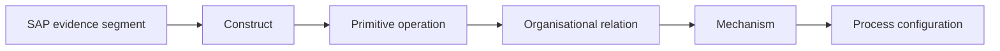
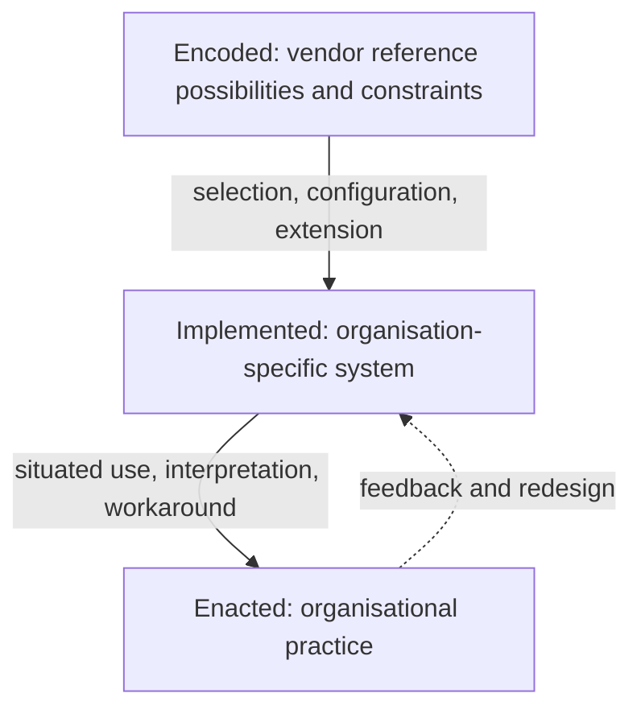

# Figure and Table Plan

## Figure 1 — Enterprise software as layered organisation design

Purpose: define the object without implying determinism. Evidence status: conceptual. Use the layered model in `02_Conceptual_Framework.md`, with a caption explaining that layers are analytical and mutually conditioning.

## Figure 2 — From primitive to mechanism

Purpose: expose the inferential chain and prevent feature labelling from becoming theory.

## Figure 3 — Research design and analytical process

Use the flow in `09_Analytical_Framework.md`, adding version freeze and negative-case loop. Evidence status: method.

## Figure 4 — Encoded, implemented, enacted

Purpose: make the study boundary visually unavoidable.

## Candidate tables

| Table | Content | Production trigger |
|---|---|---|
| 1 | Theoretical constructs, definitions, observable indicators, exclusions | Codebook frozen |
| 2 | Corpus composition by process and artefact class | Corpus closed; no invented counts |
| 3 | SAP artefact types and organisational relevance | Knowledge map validated |
| 4 | Two-stage coding framework with examples | Pilot complete |
| 5 | Cross-process mechanism configurations | Within-process analysis complete |
| 6 | Supported software organisational primitives | Inclusion test and negative cases complete |
| 7 | Candidate claims, evidence, rivals, confidence | Findings freeze |

Every empirical figure/table must carry source IDs. Captions must distinguish vendor representations from researcher reconstruction. Avoid diagrams that reproduce copyrighted SAP process models; construct analytical abstractions with citations.

